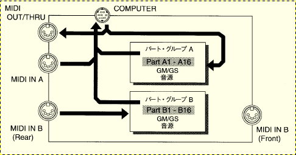
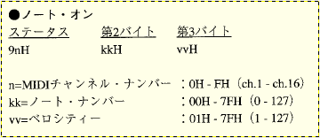
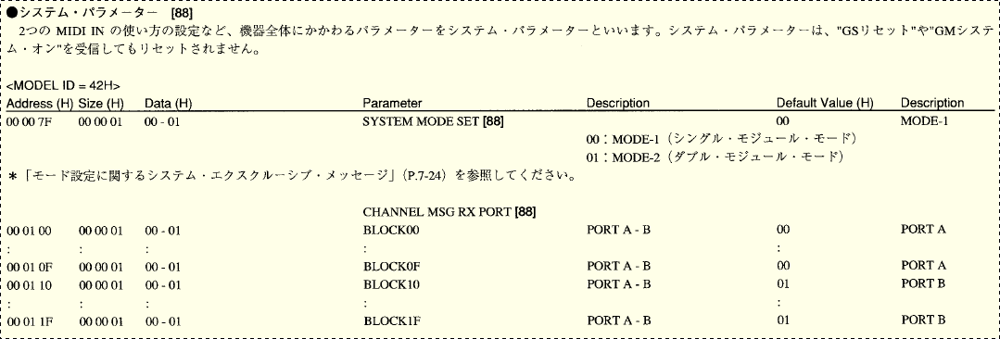

# この文書の目的
&emsp;
技術的なこと、および制作の過程で参照した資料や思考等を、参考までに残しておきます。

# RSC15toSC88 でやっていること
&emsp;
指定された 2 つの MIDI ポート（ポート A, ポート B）から受信したデータを、指定した 1 つのシリアルポートへ送信します。

&emsp;
また送信の際、ポート A のデータ送信からポート B のデータ送信に切り替えるとき **0xF5 0x02 を送信**します。逆にポート B のデータ送信からポート A のデータ送信に切り替えるとき、**0xF5 0x01 を送信**します。

&emsp;
[Hairless MIDI<->Serial Bridge](https://projectgus.github.io/hairless-midiserial/) との決定的な機能の差はこの点で、それ以外は基本的にはそれぞれの MIDI port から受信したデータを単一のシリアルポートに転送しているだけです。

# 参考とした資料
&emsp;
参考にした資料は以下です。

- MIDI SOUND GENERATOR SC-88 Pro - Roland 
http://lib.roland.co.jp/support/jp/manuals/res/1810289/SC-88Pro_j9.pdf 
0x8n～0xEn, 0xF0...0xF7 (sysEx) のメッセージについてはこちらを参考にしました。

- MIDI 1.0 規格書 - 音楽電子事業協会 
http://amei.or.jp/midistandardcommittee/MIDI1.0.pdf 
0xF1, 0xF2, 0xF3, 0xF6 のメッセージについてはこちらを参考にしました。

- NRPM - 偏ったDTM用語辞典 
https://www.g200kg.com/jp/docs/dic/nrpn.html 
NRPM ついてはこちらを参考にしました。

# 作成に至る経緯と経過
1. 大前提として。RS-MIDI（[Roland のシリアルドライバー](https://www.roland.com/jp/support/by_product/fp-2/updates_drivers/d8ea50b0-a429-42fd-b13d-b4a657eb569d)）は 32bit Windows であればサポート外の Windows 7 でも動作する。しかし 64bit Windows 用のドライバーは提供されていない。

1. 従って 64bit Windows にほぼ移行した現在の状況では RS-MIDI で演奏する方法がない。というか「ない」と思っていた。

1. [とあるページ](https://retrogameoyaji.blogspot.com/2017/10/rolandsc-88stpro.html) で [loopMIDI](https://www.tobias-erichsen.de/software/loopmidi.html) と Hairless MIDI<->Serial Bridge を使うことで RS-MIDI で演奏できるという記事を見つける。

1. でもって某所での独白・・・

	- loopMIDI ってのと Hairless MIDI Bridge ってのを使うと、RS-MIDI (RSC-15AT) 経由で接続できると・・・

	- しかし Ach と Bch 同時は無理そうね・・・うーむ。

	- しかし今更だけど、なんで RS-MIDI（Roland のシリアルドライバーを使用した場合）だと 36ch 演奏ができるのだろう？とか思うなど。

	- Hairless MIDI Bridge で MIDI の出力を RS-MIDI (Computer port) に転送して音が鳴るということは、RS MIDI で特別なプロトコルがあるのではなく、MIDI そのものが通るってことよね・・・

	- SC-88 のマニュアルみると、computer 端子って PART A にしか出力されていないようにみえる・・・
	  

	- MIDI 自身は、ch 番号は 4 bit しかないようなので 16ch 以上にはならなさそうである。
	

	- もしかして、都度 Excusive Message 出して、出力先ポートを切り替えてるんかな・・・？（汗

	- このへん・・・？
	

	- 通信をキャプチャしたくなってきたな・・ #しません

	- キャプチャしてしまった・・・
	0xF5 0x01 で A part に切り替え, 0xF5 0x02 で B part に切り替え、という感じがみえる・・・

	- あと機器側からも 0xFE だけでなく時折 0xFE, 0xF5, 0x00 を送信しているようだ・・・

	- これらのコマンド、マニュアルには載ってない気がする・・・ #見つけられないだけかもしれんが

	- 横やりで 0xF5 0x02 を送信してみたところ、モジュール側から 0xFE, 0xF5, 0x00 を戻すようになったりしたが、Hairless MIDI Bridge が例外を吐いて死ぬようになった（汗

	- Hairless MIDI Bridge も単純にブリッジしているだけではないのか・・・ #モジュールの死活確認はしている感じ？

	- Hairless MIDI Bridge、よく見てみると MidiOut を NotConnect にできるのでそうしたら例外は吐かなくなった。

	- でもって、0xF5 0x02 で Part B に切り替えられるみたいね。Part A に戻すには 0xF5 0x01。16ch まるごと入れ替わる。

	- 別にコンピューターポート独自の機能ではなさそうだから、MIDI ポート1ポートでもやれそうな感じ。試してないし試す気はないけど。

	- ただ、通信速度の上限は 38400 bps、MIDI だと 31500 bps だっけ？それ以上にはならないので 2part 32ch をそれで賄うというのは結構つらい状況になる可能性が。その点では MIDI 2port 接続のほうが通信速度的に有利。

	- ただ、32ch 演奏がコンピューターポートで賄えてた事実をみれば大した問題ではないのかもしれない。

	- ということで、

		- [com0com](https://ja.osdn.net/projects/sfnet_com0com/) あたりで仮想 COM ポートブリッジを 2 対作成する

		- Hairless MIDI Bridge を２つ起動する。

		- 2 対の仮想 COM ポートの片側を Hairless MIDI Bridge に割り当てる。

		- 2 対の仮想 COM ポートのもう片側を受信するプログラムを作る

		- 受信したデータを物理ポートに統合して送信する。

		- 送信する際、Part 切り替えが発生した場合は、0xF5 0x01 または 0xF5 0x02 を付加して流す。

		ってことをするとRS MIDI で 32ch 演奏ができるかもしれない。

	- リアルタイム性が確保できるのかどうかは知らんので、やってみてもガタガタになるかもね（汗

1. そもそも何故これまでこれを作らなかったかというと以下の 2 点の壁があったから。

	1. 32 ch 演奏用のプロトコルは MIDI とは異なる独自プロトコルで、その仕様は公開されていないと思っていたから。

	2. MIDI Out のポートを作らないとならないから。（つまりドライバーレベルのプログラミングが必要になるから）

	しかし、1 は上記にてほぼ MIDI であること、2 は Hairless MIDI<->Serial Bridge により COM まではリダイレクトされ、COM は com0com により折り返しができるので、ドライバーを作らなくても実装可能な環境になっていることに気付く。

1. じゃあ作るか・・・（ぇ

1. いやでも、2 入力 1 出力ということは、MIDI メッセージが中途半端なところで切り替わらないようにする必要があるのでは？

1. ということは、正確に MIDI メッセージの最小単位で区切る必要がある。面倒…

1. MIDI ポートを直接つかめば、そのあたりは処理してくれたりするのか？

1. Hairless MIDI<->Serial Bridge のソースコードを見ると [RTMidi](https://www.music.mcgill.ca/~gary/rtmidi/) というライブラリを使っているらしい。

1. nuget で RTMidi とか入れてみる・・・と [RTMidi.Core](https://github.com/micdah/RtMidi.Core) というのがあるらしい。

1. MIDI メッセージ単位でイベントをくれるようだ。それではこれを使うことに。

1. ただイベントで渡されるメッセージはデコード済みで、バイトストリームを取得することができない・・・（汗

1. マニュアル等を見ながら頑張ってデコード済みのメッセージからバイトストリームを復元・・・

1. 後知恵だけど、MIDI データは第一バイトは必ず 0x80～0xFF の範囲にあり、第二バイト以降は 0x00～0x7F の範囲にあるようなので、COM のリダイレクトでデータをとっても、わりと簡単に切り分けはできそうではあった。

1. まあ今更だし、Hairless MIDI<->Serial Bridge と com0com に依存せずに済むので、このまま MIDI ポートを直接つかむ方法でいくことに。

1. なんか作ってしまった・・・

1. ちゃんと鳴ってる感。

1. 公開　←いまここ

# 精度と免責
&emsp;
まず、本プログラムは 0xF5 0x?? により Part の切り替えが可能そうだ、という着想を実現したものです。これは公式な資料から導かれたものではないし、Roland のシリアルドライバーのバイナリーをリバースエンジニアリングしたものでもありません。「作成に至る経緯と経過」にあるように Roland のシリアルドライバーから出力されているデータの中に、0xF5 を先頭とするデータが余計に出力することを観測したことから冒頭の着想に至ったものです。また、前述の観測も十分な量のデータを精査,比較しているわけではないため、誤認であったり、不足する手続き等があるかもしれません。従って、この方式で確実に 32ch の演奏ができるとは限らないし、意図しない副作用が生ずる可能性が否定できません。

&emsp;
MIDI port と シリアルポートを 1:1 で接続する場合は、RSC15toSC88 を使用するより Hairless MIDI<->Serial Bridge を使用したほうが良い結果を得られる可能性があります。例えば Hairless MIDI<->Serial Bridge は（私は使ったことはありませんが）レイテンシを抑えるための仕組みも持っているようですし、音源モジュールからの MIDI In にも対応しています。（RSC15toSC88 は MIDI データの再生を目的としているので音源モジュールからの MIDI In には対応しません。）

&emsp;
加えて、RSC15toSC88 は ,net framework (C#) による実装なので、不定期なガベージコレクタ動作によってタイミングずれが発生する可能性がゼロではありませんし、ガベージコレクタが与える影響は検証していませんた。

&emsp;
また、RSC15toSC88 は MIDI メッセージのすべてを検証したわけではありません。

# 実装に関する注意事項
&emsp;
RTMidi.Core は受信したバイトストリームを直接受け取ることが出来ないので、引数として渡されるデコード済みのメッセージからバイトストリームを再構成しています。そのため、再構成に失敗するバクが潜在しているかもしれません。

&emsp;
RTMidi.Core の NRPM デコード機能 (NRPM mode = on) は使用していません。Control Change 側で処理しています。

&emsp;
シリアルポートへの送信は MIDI メッセージ単位で排他ロックを行っています。また Part 切り替え時に適切な切り替えメッセージ（0xF5 0x01 or 0xF5 0x02）を含めて排他ロックしています。従って、バグってなければメッセージが泣き別れたり意図しない Part 側にメッセージが送信されることはないはずです。

&emsp;
ガベージコレクターの実行タイミングの制御や、ガベージコレクターが動作しなくても済むような気配りは一切していません（汗

# 副作用について
&emsp;
RSC15toSC88 が 0xF5 0x01 または 0xF5 0x02 を送出することで、音源モジュールから定期的に 0xF5 0x00 を受信するようになります。これの意味するところはわかっていませんが、0xF5 から始まる MIDI メッセージは規格外です。そのためこのメッセージを受けた処理系によっては意図しない動作を引き起こす可能性があります。

&emsp;
たとえば、Hairless MIDI<->Serial Bridge はこのメッセージを受信すると例外が発生しプロセスが強制終了します。RSC15toSC88 では音源モジュールからの受信は全て空読みするので問題はないのですが、RSC15toSC88 を使用した後、Hairless MIDI<->Serial Bridge を使用するケースなどでは Hairless MIDI<->Serial Bridge が起動しない（起動直後に強制終了する）などの問題に遭遇することがあります。これを回避するためには音源モジュールをリセットスタート（＝電源off→on）するか、Hairless MIDI<->Serial Bridge の MIDI OUT を Not Connected に設定しておくかのいずれかが必要です。

